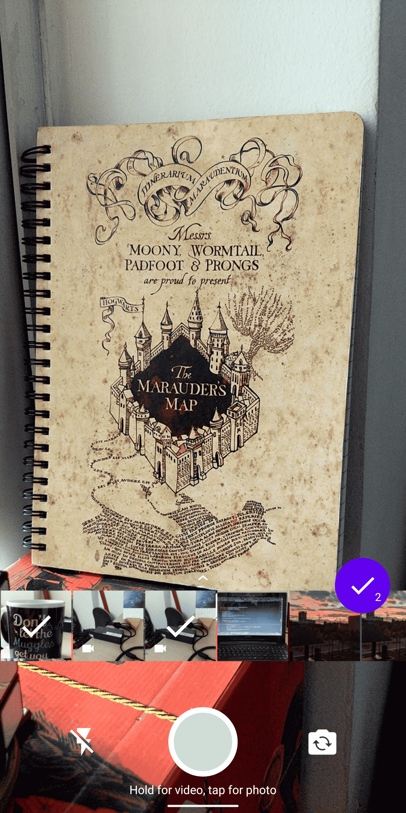
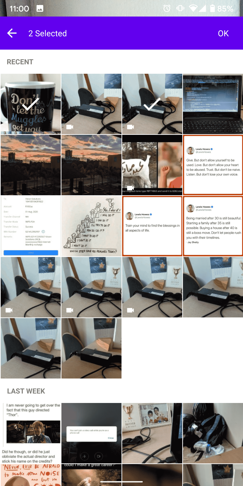
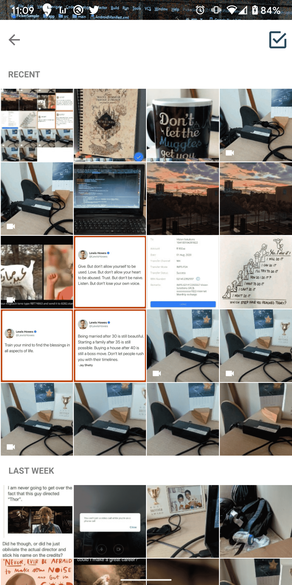

<h1 align="center">


<br/>

    Picker
</h1>


A CameraX based WhatsApp Style Image-Video Picker

## Features
1. Pick Multiple Images and Videos
2. Restrict User to Pick no of Images and Videos
3. Capture Images and Videos
4. Latest CameraX API
5. Android 10 and above Support using Scoped Storage

## Installation

Picker is distributed using [jcenter](https://bintray.com/parag2385/maven/com.appexecutors.picker).

```groovy
   repositories { 
        jcenter()
   }
   
   dependencies {
         implementation 'com.appexecutors.picker:picker:1.0.3'
   }
```

## Usage

### Initialization

```
  val mPickerOptions = 
    PickerOptions.init().apply {
        maxCount = 5                        //maximum number of images/videos to be picked
        maxVideoDuration = 10               //maximum duration for video capture in seconds
        allowFrontCamera = true             //allow front camera use
        excludeVideos = false               //exclude or include video functionalities
    }
        
   button.setOnClickListener {
        Picker.startPicker(this, mPickerOptions)    //this -> context of Activity or Fragment
   }
```

### Callback

```
   override fun onActivityResult(requestCode: Int, resultCode: Int, data: Intent?) {
        super.onActivityResult(requestCode, resultCode, data)

        if (resultCode == Activity.RESULT_OK && requestCode == REQUEST_CODE_PICKER){
            val mImageList = data?.getStringArrayListExtra(PICKED_MEDIA_LIST) as ArrayList //List of selected/captured images/videos
            mImageList.map {
                Log.e(TAG, "onActivityResult: $it" )
            }
        }
    }
```

#### Note

If you're using a theme for activity from which you're going to start Picker, then consider adding ``android:windowTranslucentStatus:true`` in that theme

```
    <style name="AppTheme.NoActionBar" parent="Theme.AppCompat.Light.NoActionBar">        //If you're using this theme
        <item name="windowActionBar">false</item>
        <item name="windowNoTitle">true</item>
        <item name="android:windowTranslucentStatus">true</item>                          //Add this line
    </style>
```

For detailed example of usage, please look at the included sample app.

#### Try [PicEditor](https://github.com/Parag2385/PicEditor) - A WhatsApp style Image Editor


License
-------

    Copyright 2020 Parag Pawar

    Licensed under the Apache License, Version 2.0 (the "License");
    you may not use this file except in compliance with the License.
    You may obtain a copy of the License at

       http://www.apache.org/licenses/LICENSE-2.0

    Unless required by applicable law or agreed to in writing, software
    distributed under the License is distributed on an "AS IS" BASIS,
    WITHOUT WARRANTIES OR CONDITIONS OF ANY KIND, either express or implied.
    See the License for the specific language governing permissions and
    limitations under the License.
